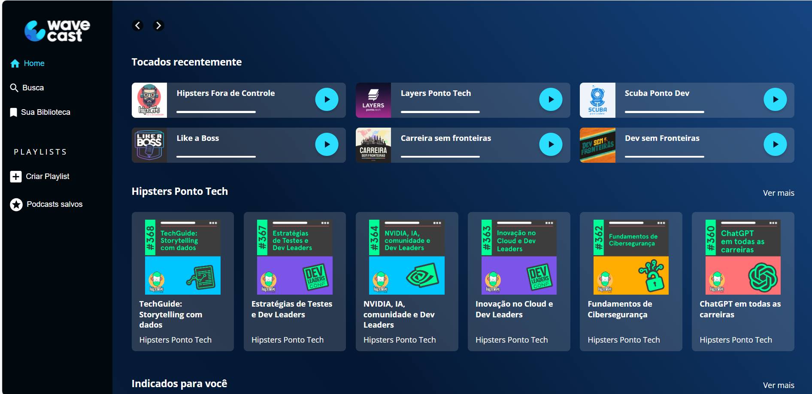

# WaveCast 🌊🎧

## 📄 Resumo
WaveCast é um projeto desenvolvido no curso **CSS: Construindo Layouts com Grid**, da Alura. O projeto consiste em um layout responsivo para um site de podcast, utilizando as técnicas aprendidas durante o curso para construir layouts modernos com o auxílio da propriedade CSS Grid.

  

## ⚙️ Tecnologias Utilizadas
- HTML5
- CSS3
- Grid Layout

## 📅 Última Atualização
- **Data**: Jan.2025

